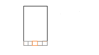

小程序项目最近要改版，底部是tab导航栏，对应切换各个页面。这样的需求看起来也是比较简单的，就配置个tabbar，然后改改ui就可以。但是有个tab比较特殊，是扫一扫功能。
ui效果图

中间橙色部分为扫一扫
## 无法按照设计图的tab中间图片需要突出的效果
 因为用的小程序提供的tabbar导航栏，只能在app.json文件配置一些tab的图标和文字，所以没有办法在tabbar里面做到移动图片的位置。虽然也有在网上找到自定义tabbar，但是引入进来小程序开发工具直接报错了，看到的github issue也有人提出问题，不过作者还没解决。所以这个ui效果只能放弃。
<!--truncate-->

## 点击中间tab需要直接调起扫一扫
我的做法是点击中间tab，跳到一个空白页，页面监听`onTabItemTap`事件，在这个事件里面，直接调起扫一扫。

## 在扫一扫界面点击左上角返回，需要返回前一个页面
意思就是当前在第一个tab，然后点击了中间的扫一扫，这个时候点了返回，页面需要返回第一个tab。明白了需求肯定就是查怎么去监听这个返回操作，直接网上搜，有说到通过页面的生命周期函数`onShow`。在中级tab页的写了`onShow`,扫一扫返回的时候的确触发了`onShow`，所以以为简单了。就在调起扫一扫，之前设置了一个storage的key值，作用类似app的全局变量意思。只要在`onShow`里面判断这个标志位，就去跳转页面。当前切换tab的时候，也是需要通过storage来保存页面的url的，这样到时就能直接使用`wx.switch`来跳了（`特别说明下，跳转tab的页面只能使用wx.switch来跳转，这个在小程序的文档也有说明`）。前面已经能实现在扫一扫界面按返回可以跳回上一个前面了。那么接下来就是扫码后的处理了。项目扫码成功后，会调用接口，然后判断一下码是不是正确之类的处理。是正确的二维码时，就跳转到支付页。入坑开始。。。。

我发现在扫码成功时会先跳到前一个页面，然后数据请求完成时，再跳到支付页。这样的情况我觉得是个问题，虽然没有问过产品这样做是否也可以。毕竟每次都跳回前一个页面，交互体验感非常不好。 然后就开始找原因。然后发现，扫二维码的时候，中间页面的`onShow`竟然也触发了，导致跟在扫一扫界面按返回的情况一样了。这样逻辑就重叠了。按正常逻辑肯定是想扫二维码的时候也设置一个状态，然后在onshow这边判断一下就可以。然而并没有这么简单，我尝试了发现根本就没有地方设置这个值。
```
wx.scanCode({
  success: (res) => {
    console.log(res)
  }
})
```
上面是文档给出的demo，我在success的时候设置状态是没有任何作用的，感觉success没有开始，`onShow`已经触发了。然后这里感觉我被逻辑绕晕了，然后重新在纸上画逻辑图。发现扫一扫界面按返回以及扫码成功时状态值是一样的，因为扫码成功没有地方设置状态。这样难道意味着这个问题无法解决了？这样问题在网上搜索也没有任何相关的。那只能自己继续看看小程序的文档了，然后就是各种尝试吧。在文档中看着页面的跳转会触发页面对应的生命周期函数，也不断的尝试，最终都没有解决。最后在`wx.scanCode`api中看了看，试了试对应的函数，比如complete，突然发现好像按返回的时候，complete这个回调函数触发了，然后我就用fail回调函数，神奇的结果，在页面扫一扫的时候点击返回会触发这个fail函数。这样的话，我只需要在fail的时候去跳转到前一个页面就可以了，`onShow`里面就不处理任何东西了。这样能避免在扫码成功时会先跳到前一个页面，然后再跳到支付页面。调试了代码，问题完全解决！这个坑足足困了几天，小程序文档并没有说明在扫一扫的时候按左上角返回时，会触发`fail`回调函数，因为在文档里面的路由部分只是说到按左上角的返回会触发路由后的页面的`onShow`函数。所以就一直觉得只能是`onShow`这里来处理了。

### 一些无法知道的原因
主要抓了主要的过程写，其实其中尝试过很多方法，耗比较多时间。`onShow`触发的问题，页面进来直接调起扫一扫，按返回的时候，不知道为什么页面会两次触发`onShow`，一次是返回到该页面会触发这个知道，然而还会继续触发第二次是在不知道什么原因，可能是调用扫一扫这个再触发一次吧，这个原因也不知道是什么，对照了很久文档中的路由部分，实在是没看出为什么会触发第二次。
