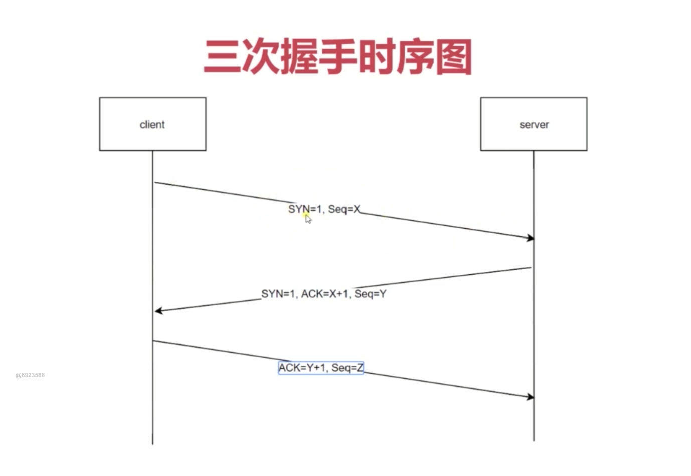

## 1. 网络模型
包括应用层（http，ftp） -> 传输层（TCP，UDP）-> 网络层 -> 数据链路层 -> 物理层
<!--truncate-->

## 2. http的三次握手
tcp创建的时候需要三次握手

第一次 client 发送 SYN = 1, Seq = X，Server接收到（Server端： 知道client可以发送数据，Server能接收数据）

第二次 Server 收到连接，开启一个端口，并返回一个响应
SYN = 1 ACK = X + 1 Seq = Y。client接收到数据（client端：知道Server可以收发数据，client能收发数据）

第三次 client 收到服务端的应答，知道服务端允许客户端打开tcp连接，在client发送一个应答 ACK = Y + 1 Seq = Z, tcp建立（Server端：知道Server可以收发数据, client也能收发数据）

### 为什么需要三次握手
如果只有两次握手，client因为网络原因而丢失数据，但是server端一直不知道，那么tcp连接就一直开着。这样就会一直占用server端的开销。三次握手就是为了规避这种问题，来减少服务端的开销
[参考链接](https://zhuanlan.zhihu.com/p/53374516)

## 3. URI URL URN
URI: 统一资源标志符，包括URL和URN

URL: 统一资源定位器，组成：协议 + Host（主机）+ 端口（80）+ 路由 + 参数 + hash(锚点)

URN: 永久统一资源定位符
