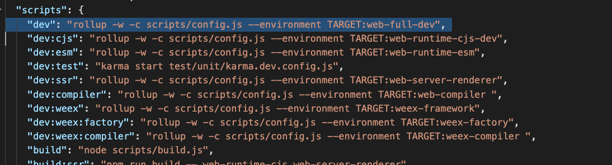
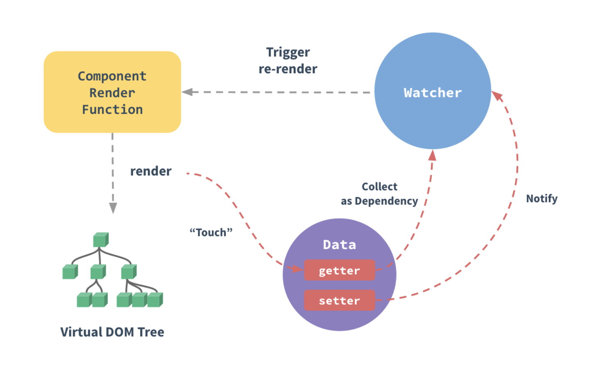

## 如何阅读

在阅读源码时，我的个人做法是
1. 网上找找有没有对应博客分享，先去看看别人是如何理解的
2. 查找有没有对应的源码整体架构图，并不是文件夹目录介绍，是这份源码的实现流程图
3. 下载源码后，首先要找的就是源码入口
4. 在阅读源码的过程中，要用思维导图，将自己看过的地方记录下来。并不是记录具体代码，而是代码块实现的什么功能有什么用，记录下来。为什么要这样呢，因为后面再回去看的时候可以结合思维导图，看看什么地方自己了解的，还有什么地方自己不明白的。做到看过也能有印象

## 入口

### 	找入口文件

在package.json中直接找入口，并不是main属性指定的文件地址，因为main属性是production环境下使用的包。



在scripts中可以看到dev的环境区分了很多中环境，这里我们主要找的到是web全平台的，也就是第一，在scripts/config.js中有配置

打开`scripts/config.js`找到对应的环境`web-full-dev`

```js
'web-full-dev': {
    entry: resolve('web/entry-runtime-with-compiler.js'),
    dest: resolve('dist/vue.js'),
    format: 'umd',
    env: 'development',
    alias: { he: './entity-decoder' },
    banner
  },
```

可以看到entry已经找到了，因为这个文件有定义了resolve函数，所以entry是`src/platforms/web/entry-runtime-with-compiler.js`

从这里也能看出vue处理各自不同环境，分别定义不同入口，工程化方面做的非常好

<!--truncate-->
### 	入口文件内容

在这里能看到拿出了Vue构造函数，然后对这个构造函数原型的$mount方法进行了重新的定义

​	具体逻辑是

	1. 先拿出Vue构造函数原型中的$mount方法
 	2. 重新定义一个$mount
 	3. 对$mount的行参进行处理
 	4. （在没有定义render时）找出template
      	1. 如果是字符串，可能是元素id
      	2. 直接是元素，则拿元素的innerHTML
      	3. 如果有el属性，则获取el的html
 	5. 通过compileToFunctions函数给给options中定义个render函数

可见new Vue的时候，根据参数，可得出不同参数的顺序，render  ->   template - > el

最后导出Vue构造函数

上面entry-runtime-with-compiler.js在 `src/platforms/web/runtime/index.js`导入了Vue，所以继续在这个js看

在这里可以看到一些比较有用的东西

```js
// install platform runtime directives & components
extend(Vue.options.directives, platformDirectives)
extend(Vue.options.components, platformComponents)
// install platform patch function
Vue.prototype.__patch__ = inBrowser ? patch : noop

// public mount method
Vue.prototype.$mount = function () {...}
```

对Vue的指令以及组件进行了拓展，__patch__暂时不知道是什么用，实际是它虚拟DOM patch函数，最后定义了$mount方法,

最后找到真正的入口`src/core/instance/index.js`，在这里定义了vue的构造函数，以及各种初始化

## 初始化做了哪些事情

看看初始化的代码

```js
function Vue (options) {
  this._init(options)
}
initMixin(Vue)
stateMixin(Vue)
eventsMixin(Vue)
lifecycleMixin(Vue)
renderMixin(Vue)
```

构造函数的定义的_init函数没有看到定义的地方，暂时往下看

#### initMixin

initMixin 在`src/core/instance/init.js`中定义，就是定义了在vue原型中加了_init函数，这个函数里面总结主要就是

```js
initLifecycle(vm)
initEvents(vm)
initRender(vm)
callHook(vm, 'beforeCreate')
initInjections(vm) // 在data，以及props之前处理inject的数据， resolve injections before data/props
initState(vm)
initProvide(vm) // resolve provide after data/props
callHook(vm, 'created')
```

initLifecycle：初始化一些基本生命周期状态，子元素数组，找到父元素

initEvents： 初始化父级元素定义的事件

initRender： 定义$slots,slotScopes 插槽的内容，并在vue上重定义$createElement 函数，对$attrs， $listeners这些属性定义为响应式数据

callHook： 触发对应的生命周期钩子，这里面如果定义了hook事件，vue会触发一个hook事件通知

initInjections：对inject属性的处理

initState： 对options中的各属性进行数据初始化，如props，methods，datacomputed，watch进行初始化处理

initProvide： 对provide属性的处理

#### stateMixin

对$data、$props,使用对象的get方法重新定义，例如data中的属性，可以通过$data来代理访问

定义了$set、$delete、$watch 这些方法绑定到原型上

#### eventsMixin

定义监听事件即经常说的事件总线，订阅发布模式

#### lifecycleMixin

定义了_update、$forceUpdate、$destroy方法

#### renderMixin

定义了$nextTick、_render方法

## 数据响应化

响应式利用了js对象的Object.defineProperty中的getter，以及setter的拦截，对数据更新进行了重新的定义

先要对响应式过程有一个了解



在组件开始render时，先对数据进行了一次拦截处理，每次getter属性访问的时候进行了一次Dep依赖收集，收集着对应的watcher。每次setter触发的时候就通知watcher进行了重新的渲染，这个过程写在initState中。要想理解这个过程先要对几个关键词概念有认识

1. Observer 观察者，对data中的数据进行初始化的入口
2. Dep 依赖收集，每次data中的属性有getter时，就进行一次依赖收集，收集对应的watcher
3. Watcher 组件data实例化时会实例一个watcher，有一个update函数放着VDOM的更新函数，在触发数据setter时，会触发watcer的update函数

现在开始在代码详细看看他们是如果运行的

首页在初始化data的时候`src/core/instance/state.js`，initData这个方法做了两件事首先把data中所有的属性通过proxy代理到_data

对象中，提供给内部使用。然后在observe中新建一个Observer的实例

#### Observer

在Observer中把data进行分类处理，observeArray处理数组类型，walk处理对象类型

先看看对象类型的处理，关键函数defineReactive，把data中所有的数据都在这个函数中使用Object.defineProperty进行重新定义,

```js
function defineReactive () {
	 let childOb = !shallow && observe(val)
   Object.defineProperty(obj, key, {
  	get: function reactiveGetter () {
      // 如果有Dep.target（target实际上是watcher）
  		if (Dep.target) {
       // 进行依赖收集
  		 dep.depend()
  			...
  		}
  		return value
  	},
    set: function reactiveSetter (newVal) { 
    	if (setter) {
        setter.call(obj, newVal)
      } else {
        val = newVal
      }
      // 设置新值时，递归子对象
      childOb = !shallow && observe(newVal)
      // 设置属性，触发dep中watcer的update函数更新
      dep.notify()
    }
  })
}
```

对defineReactive进行了精简，对data的属性进行了一个递归，如果属性值是对象会继续往下递归

#### Dep

Dep的定义其实是比较简单的，subs存放所有的依赖，定义addSub，removeSub添加移除依赖函数，notify通知所有的依赖进行更新

depend在Watcher中来触发添加依赖的动作

#### Watcher

先看看实例化的时候做了哪些事情

```js
this.vm = vm
// 在vue中的_watchers添加当前watcher实例
vm._watchers.push(this)
// options，watcher的option处理
if (options) {
	...
} else {
this.deep = this.user = this.lazy = this.sync = false
}
this.deps = [] // 在依赖收集的同时，也把dep记录下来
// parse expression for getter
if (typeof expOrFn === 'function') {
    this.getter = expOrFn
  } else {
    this.getter = parsePath(expOrFn)
  }
}
this.value = this.lazy
? undefined
: this.get() // 触发一次get函数
```

主要是get函数

```js
pushTarget(this)
value = this.getter.call(vm, vm)
```

这里将Dep的target绑定为watcher

然后触发了一个getter函数，这个getter函数是在实例化的时候作为expOrFn参数传进来的，所以要找的Watcher实例化的地方

就在`src/core/instance/lifecycle.js`mountComponent中updateComponent函数

在new Watcher的时候，定义updateComponent函数执行`vm._update(vm._render(), hydrating)`这段代码，也就是Vue的原型中定义的_update，对新旧的vnode进行了diff算法的对比，执行完`__patch__`后，$el的元素就有了初始化的子元素，挂载到了el上。然后触发了mounted钩子

## 虚拟DOM

虚拟dom的diff就在刚刚的`__patch__`中

最终函数定义在`src/core/vdom/patch.js`的 createPatchFunction中，现在这个函数主要是把虚拟dom转化为真实dom

也就是返回的patch函数

```js
return function patch (oldVnode, vnode, hydrating, removeOnly) {
    // 没有新vnode，只有老的，是删除操作，直接把老节点删掉
    if (isUndef(vnode)) {
      if (isDef(oldVnode)) invokeDestroyHook(oldVnode)
      return
    }

    let isInitialPatch = false
    const insertedVnodeQueue = []
    // 没有老vnode，创建vnode操作
    if (isUndef(oldVnode)) {
      // empty mount (likely as component), create new root element
      isInitialPatch = true
      createElm(vnode, insertedVnodeQueue)
    } else {      
      const isRealElement = isDef(oldVnode.nodeType)
      if (!isRealElement && sameVnode(oldVnode, vnode)) {
        // patch existing root node
        // 不是真实dom，对比两个vnode是否相同，执行补丁算法，diff，patchVnode是真正的diff算法核心
        patchVnode(oldVnode, vnode, insertedVnodeQueue, null, null, removeOnly)
      } else {
        // 对真实dom的处理
        if (isRealElement) {
          // mounting to a real element
          // check if this is server-rendered content and if we can perform
          // a successful hydration.
          // 服务端渲染的处理
          if (oldVnode.nodeType === 1 && oldVnode.hasAttribute(SSR_ATTR)) {
            oldVnode.removeAttribute(SSR_ATTR)
            hydrating = true
          }
          if (isTrue(hydrating)) {
            if (hydrate(oldVnode, vnode, insertedVnodeQueue)) {
              invokeInsertHook(vnode, insertedVnodeQueue, true)
              return oldVnode
            } else if (process.env.NODE_ENV !== 'production') {
             ...
            }
          }
          // either not server-rendered, or hydration failed.
          // create an empty node and replace it
          oldVnode = emptyNodeAt(oldVnode)
        }

        // replacing existing element
        const oldElm = oldVnode.elm
        const parentElm = nodeOps.parentNode(oldElm)

        // create new node
        // 创建新的dom
        createElm(
          vnode,
          insertedVnodeQueue,
          oldElm._leaveCb ? null : parentElm,
          nodeOps.nextSibling(oldElm)
        )
        // update parent placeholder node element, recursively
          // 如果vnode定义了parent，则递归往上级更新
        if (isDef(vnode.parent)) {
          let ancestor = vnode.parent
          const patchable = isPatchable(vnode)
          while (ancestor) {
            for (let i = 0; i < cbs.destroy.length; ++i) {
              cbs.destroy[i](ancestor)
            }
            ancestor.elm = vnode.elm
            if (patchable) {
              for (let i = 0; i < cbs.create.length; ++i) {
                cbs.create[i](emptyNode, ancestor)
              }
              // #6513
              // invoke insert hooks that may have been merged by create hooks.
              // e.g. for directives that uses the "inserted" hook.
              const insert = ancestor.data.hook.insert
              if (insert.merged) {
                // start at index 1 to avoid re-invoking component mounted hook
                for (let i = 1; i < insert.fns.length; i++) {
                  insert.fns[i]()
                }
              }
            } else {
              registerRef(ancestor)
            }
            ancestor = ancestor.parent
          }
        }

        // destroy old node
        // 在替换操作前，找到父级元素，把当前的老节点删除掉
        if (isDef(parentElm)) {
          removeVnodes([oldVnode], 0, 0)
        } else if (isDef(oldVnode.tag)) {
          invokeDestroyHook(oldVnode)
        }
      }
    }
   // 触发vnode父级的hook钩子
    invokeInsertHook(vnode, insertedVnodeQueue, isInitialPatch)
    return vnode.elm
  }
```

再看看createElm函数做了什么事情

```js
function createElm () {
    if (isDef(vnode.elm) && isDef(ownerArray)) {
      // This vnode was used in a previous render!
      // now it's used as a new node, overwriting its elm would cause
      // potential patch errors down the road when it's used as an insertion
      // reference node. Instead, we clone the node on-demand before creating
      // associated DOM element for it.
      vnode = ownerArray[index] = cloneVNode(vnode)
    }

    vnode.isRootInsert = !nested // for transition enter check
  	// 如果是定义的组件则return
    if (createComponent(vnode, insertedVnodeQueue, parentElm, refElm)) {
      return
    }

    const data = vnode.data
    const children = vnode.children
    const tag = vnode.tag
    if (isDef(tag)) {
      if (process.env.NODE_ENV !== 'production') {
        if (data && data.pre) {
          creatingElmInVPre++
        }
      }
			// 通过createElementNS 或者createElement创建出真实dom
      vnode.elm = vnode.ns
        ? nodeOps.createElementNS(vnode.ns, tag)
        : nodeOps.createElement(tag, vnode)
      // 对元素进行css的scoped标记 set scope id attribute for scoped CSS.
      setScope(vnode)

      /* istanbul ignore if */
      if (__WEEX__) {
       ...
      } else {
        // 对children进行递归遍历不断
        createChildren(vnode, children, insertedVnodeQueue)
        if (isDef(data)) {
          invokeCreateHooks(vnode, insertedVnodeQueue)
        }
        insert(parentElm, vnode.elm, refElm)
      }

      if (process.env.NODE_ENV !== 'production' && data && data.pre) {
        creatingElmInVPre--
      }
    } else if (isTrue(vnode.isComment)) {
      // 对注释节点的创建
      vnode.elm = nodeOps.createComment(vnode.text)
      insert(parentElm, vnode.elm, refElm)
    } else {
      // 创建纯文本类型
      vnode.elm = nodeOps.createTextNode(vnode.text)
      insert(parentElm, vnode.elm, refElm)
    }
  }
```

在新老vnode都存在的时候就要进行dom diff算法，也就是这个patchVnode，做三种操作 属性更新Props、文本更新TEXT、子节点更新 peorder。需要提到的是虚拟dom的数据结构 {text: '', children: []}, 要么text（代表纯文本）有值，要么children（有子元素）有值，不会两者同时存在

```js
function patchVnode () {
    if (oldVnode === vnode) {
      return
    }

    if (isDef(vnode.elm) && isDef(ownerArray)) {
      // clone reused vnode
      vnode = ownerArray[index] = cloneVNode(vnode)
    }

    const elm = vnode.elm = oldVnode.elm

    if (isTrue(oldVnode.isAsyncPlaceholder)) {
      if (isDef(vnode.asyncFactory.resolved)) {
        hydrate(oldVnode.elm, vnode, insertedVnodeQueue)
      } else {
        vnode.isAsyncPlaceholder = true
      }
      return
    }

    // reuse element for static trees.
    // note we only do this if the vnode is cloned -
    // if the new node is not cloned it means the render functions have been
    // reset by the hot-reload-api and we need to do a proper re-render.
    if (isTrue(vnode.isStatic) &&
      isTrue(oldVnode.isStatic) &&
      vnode.key === oldVnode.key &&
      (isTrue(vnode.isCloned) || isTrue(vnode.isOnce))
    ) {
      vnode.componentInstance = oldVnode.componentInstance
      return
    }

  	// 属性更新
    let i
    const data = vnode.data
    if (isDef(data) && isDef(i = data.hook) && isDef(i = i.prepatch)) {
      i(oldVnode, vnode)
    }
    // 获取新旧节点
    const oldCh = oldVnode.children
    const ch = vnode.children

    if (isDef(data) && isPatchable(vnode)) {
      for (i = 0; i < cbs.update.length; ++i) cbs.update[i](oldVnode, vnode)
      if (isDef(i = data.hook) && isDef(i = i.update)) i(oldVnode, vnode)
    }
    // 节点更新
    if (isUndef(vnode.text)) {
      // 新老孩子都有，diff操作
      if (isDef(oldCh) && isDef(ch)) {
        if (oldCh !== ch) updateChildren(elm, oldCh, ch, insertedVnodeQueue, removeOnly)
      } else if (isDef(ch)) {
        // 只有新孩子存在
        if (process.env.NODE_ENV !== 'production') {
          checkDuplicateKeys(ch)
        }
        // 把老节点清空，放入新增的孩子
        // 先清掉文本
        if (isDef(oldVnode.text)) nodeOps.setTextContent(elm, '')
        // 再增加文本
        addVnodes(elm, null, ch, 0, ch.length - 1, insertedVnodeQueue)
      } else if (isDef(oldCh)) {
        // 老存在，新不存在，没有新的孩子，删除操作
        removeVnodes(oldCh, 0, oldCh.length - 1)
      } else if (isDef(oldVnode.text)) {
        // 老的有文本，新的没有，清楚文本
        nodeOps.setTextContent(elm, '')
      }
    } else if (oldVnode.text !== vnode.text) {
      // 都有文本，替换为新文本
      nodeOps.setTextContent(elm, vnode.text)
    }
    if (isDef(data)) {
      if (isDef(i = data.hook) && isDef(i = i.postpatch)) i(oldVnode, vnode)
    }
  }
```

复杂diff 算法 updateChildren

```js
function updateChildren (parentElm, oldCh, newCh, insertedVnodeQueue, removeOnly) {
	let oldStartIdx = 0 // 老开始
  let newStartIdx = 0 // 新开始
  let oldEndIdx = oldCh.length - 1 // 老结束
  let oldStartVnode = oldCh[0]
  let oldEndVnode = oldCh[oldEndIdx]
  let newEndIdx = newCh.length - 1 // 新结束
  let newStartVnode = newCh[0]
  let newEndVnode = newCh[newEndIdx]
  let oldKeyToIdx, idxInOld, vnodeToMove, refElm

  // removeOnly is a special flag used only by <transition-group>
  // to ensure removed elements stay in correct relative positions
  // during leaving transitions
  const canMove = !removeOnly
  // 循环条件，老开小于老结束同时新开小于新结束
  while (oldStartIdx <= oldEndIdx && newStartIdx <= newEndIdx) {
    if (isUndef(oldStartVnode)) {
      oldStartVnode = oldCh[++oldStartIdx] // Vnode has been moved left
    } else if (isUndef(oldEndVnode)) {
      oldEndVnode = oldCh[--oldEndIdx]
      // 老开跟新开一样，则平移一位游标，新的老开节点和新开节点重新赋值
    } else if (sameVnode(oldStartVnode, newStartVnode)) {
      patchVnode(oldStartVnode, newStartVnode, insertedVnodeQueue, newCh, newStartIdx)    
      oldStartVnode = oldCh[++oldStartIdx]
      newStartVnode = newCh[++newStartIdx]
    } else if (sameVnode(oldEndVnode, newEndVnode)) {
      // 老结束也是同样的处理
      patchVnode(oldEndVnode, newEndVnode, insertedVnodeQueue, newCh, newEndIdx)
      oldEndVnode = oldCh[--oldEndIdx]
      newEndVnode = newCh[--newEndIdx]
    } else if (sameVnode(oldStartVnode, newEndVnode)) { // Vnode moved right
      // 老开跟新结束相同
      patchVnode(oldStartVnode, newEndVnode, insertedVnodeQueue, newCh, newEndIdx)
      canMove && nodeOps.insertBefore(parentElm, oldStartVnode.elm, nodeOps.nextSibling(oldEndVnode.elm))
      oldStartVnode = oldCh[++oldStartIdx]
      newEndVnode = newCh[--newEndIdx]
    } else if (sameVnode(oldEndVnode, newStartVnode)) { // Vnode moved left
      // 老结束跟新开始相同
      patchVnode(oldEndVnode, newStartVnode, insertedVnodeQueue, newCh, newStartIdx)
      canMove && nodeOps.insertBefore(parentElm, oldEndVnode.elm, oldStartVnode.elm)
      oldEndVnode = oldCh[--oldEndIdx]
      newStartVnode = newCh[++newStartIdx]
    } else {
      if (isUndef(oldKeyToIdx)) oldKeyToIdx = createKeyToOldIdx(oldCh, oldStartIdx, oldEndIdx)
      idxInOld = isDef(newStartVnode.key)
        ? oldKeyToIdx[newStartVnode.key]
      : findIdxInOld(newStartVnode, oldCh, oldStartIdx, oldEndIdx)
      // 创建节点，如果新节点下标不存在，那么创建新元素
      if (isUndef(idxInOld)) { // New element
        createElm(newStartVnode, insertedVnodeQueue, parentElm, oldStartVnode.elm, false, newCh, newStartIdx)
      } else {
        vnodeToMove = oldCh[idxInOld]
        // 如果下标存在，对比是不是相同节点
        if (sameVnode(vnodeToMove, newStartVnode)) {
          patchVnode(vnodeToMove, newStartVnode, insertedVnodeQueue, newCh, newStartIdx)
          oldCh[idxInOld] = undefined
          canMove && nodeOps.insertBefore(parentElm, vnodeToMove.elm, oldStartVnode.elm)
        } else {
          // key一样，不同的元素，创建新元素
          // same key but different element. treat as new element
          createElm(newStartVnode, insertedVnodeQueue, parentElm, oldStartVnode.elm, false, newCh, newStartIdx)
        }
      }
      newStartVnode = newCh[++newStartIdx]
    }
  }
  // 都不符合上面猜想的情况或者针对遍历完剩下的元素
  if (oldStartIdx > oldEndIdx) {
    refElm = isUndef(newCh[newEndIdx + 1]) ? null : newCh[newEndIdx + 1].elm
    // 老开始大于老结束，先遍历完老的，则是新增操作，把剩下的新节点进行插入追加
    addVnodes(parentElm, refElm, newCh, newStartIdx, newEndIdx, insertedVnodeQueue)
  } else if (newStartIdx > newEndIdx) {
    // 遍历完一次后，新开大于新结束，则删掉老的节点
    removeVnodes(oldCh, oldStartIdx, oldEndIdx)
  }
}
```

vue的基本流程就走完了，还有各种api的源码仍然需要继续学习，都在initGlobalAPI（src/core/index.js）里面

