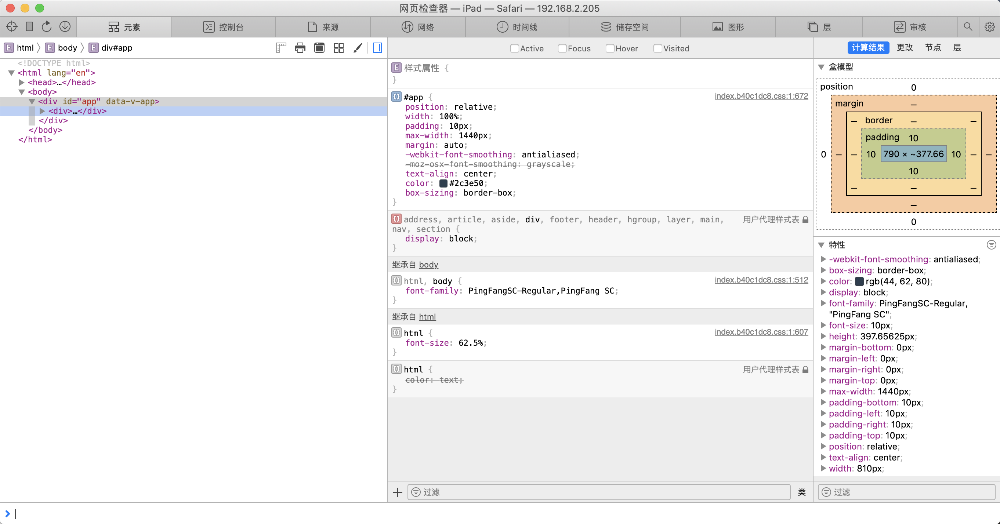
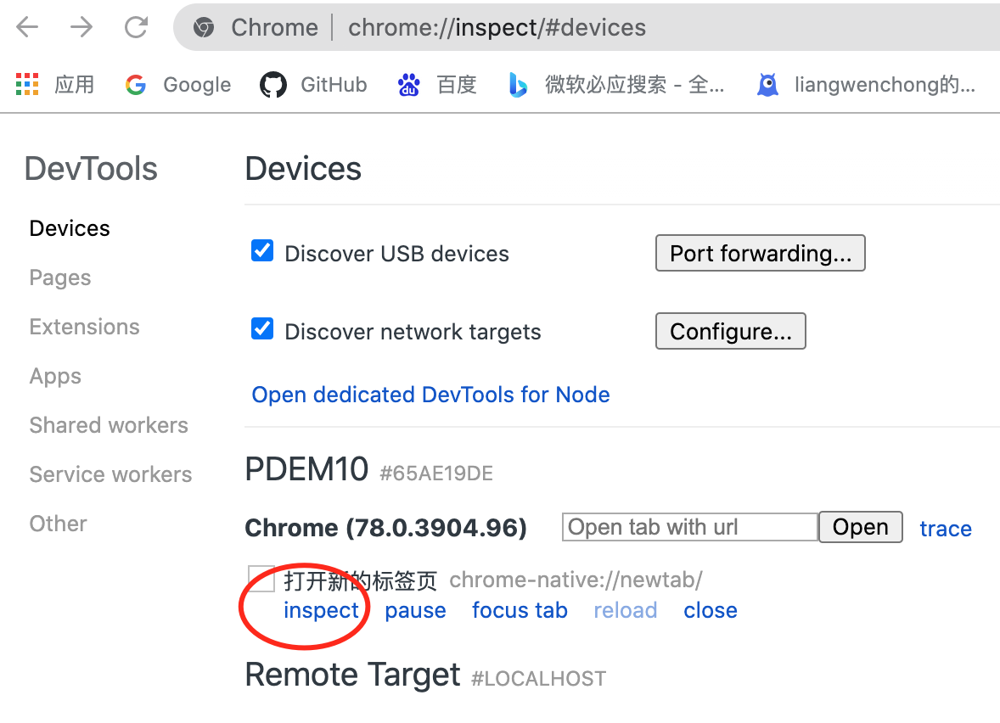
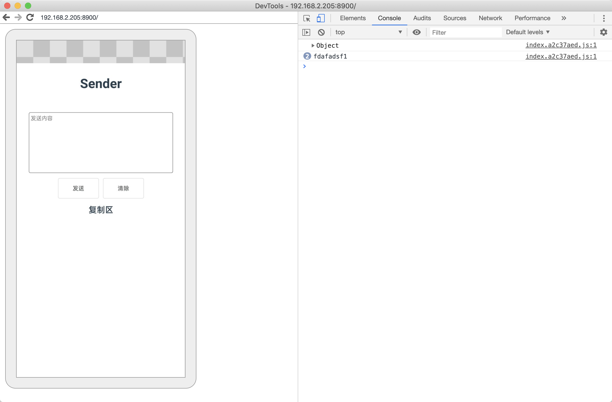

开发h5页面的时候，在测试时遇到bug如果单凭vconsole这类工具还是会比较弱的。有时候想要修改页面元素，或者查看元素，在浏览器上查看就会很方便，这里分享一下如何通过电脑来调试真机的页面

## 安卓

在谷歌浏览器安装**ADB plugin**

安卓手机通过数据线连接到电脑上，弹出USB用于的弹框，选择传输文件

手机在开发者选项中找到USB调试，打开USB调试

然后在**手机的谷歌浏览器**中打开对应网址，在电脑的谷歌浏览器上输入chrome://inspect/#devices

就能看到手机设备
<!--truncate-->

点击inspect后

显示的就是手机上的页面然后可以像在pc上一样去调试页面了

### 内嵌app的h5页面

对于在公司产品的app上内嵌h5页面，可以叫安卓的同学打开**webview的调试**，然后进入对应的页面后，在上面的chrome://inspect/#devices地址也能看到，不过这种方式是需要 **fan墙** 的支持，不然是没办法看到页面的

## iOS

手机进入设置，找到safari浏览器，进入找到高级选项然后打开网页检查器选项

在电脑的safari上找到开发选项，找到对应的ios设备，然后右侧会展示对应的链接，点击进入链接，就会打开调试面板

找不到开发选项的，需要在偏好设置中》高级》勾选在菜单栏中显示开发菜单

然后就可以像在开发的时候一样调试了

## 对于在微信公众号之类的页面

1. 使用vconsole，基本能够满足调试目的，能看数据，也能看元素
2. 对于上线的产品，可以考虑fiddler，wireshark，lightproxy，whistle等抓包工具
3. 使用微信开发者工具，能够模拟在微信中打开的真实场景，对开发者也相当友好

