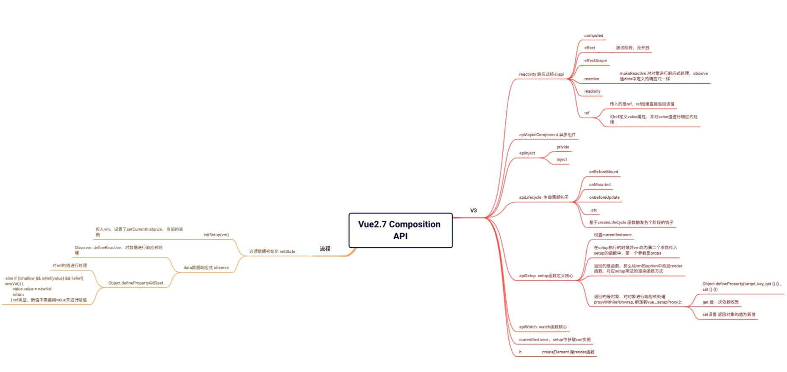

在2.7中新增了Composition API，解决了mixin的问题

如果是老项目可以尝试升级一下，hook的方式极大的提升了代码质量

下面大概说一下源码组合式API的流程

在最新的代码中可以看到vue已经全部使用ts进行了重写，在看源码时提供了极大的便利。

组合式API主要集中在 `src/v3`文件夹内，完全对应vue3的的组合式API的写法

<!--truncate-->

在`v3/apiSetup`文件中定义了setup函数的核心`initSetup`

跟着initSetup看看调用的地方

在Vue初始化时的initState中调用了initSetup并把vm实例传入setup中，就这样组合式API可以在vue中使用了

简单介绍下setup使用的响应式为什么可以发生双向数据绑定

在setup中定义响应式数据reactive以及ref

在reactive源码中，其实就是对传入的对象进行了一个响应式处理，对数据进行observe。与2.7前的版本中data定义的数据进行了一样的处理，所以reactive的数据也会是双向数据绑定，get的时候添加了dep依赖，set的时候对通知依赖进行更新，触发页面的render

ref中也是类似，如果传入的值是ref则直接把ref的实例进行复制，否则在ref中定义一个value的属性，并把传入的值进行响应式处理observe，与reactive类似

实际的原理就是脱离不了响应式的部分代码，针对这两个api进行处理，与在data中定义变量一样。对于setup中使用的其他api不进行过多描述。

另外在observe的时候加了对ref的数据进行处理，就是解构ref类型的数据，如果set的数据是ref类型的数据那么对ref.value直接赋值，就不需要自己手动用.value的方式进行赋值，在深层响应式对象使用时可以体现这个操作

apiInject apiLifecycle这些api比较简单，就是在对vm实例上添加对应属性就可以使用

附上简单思维导图

